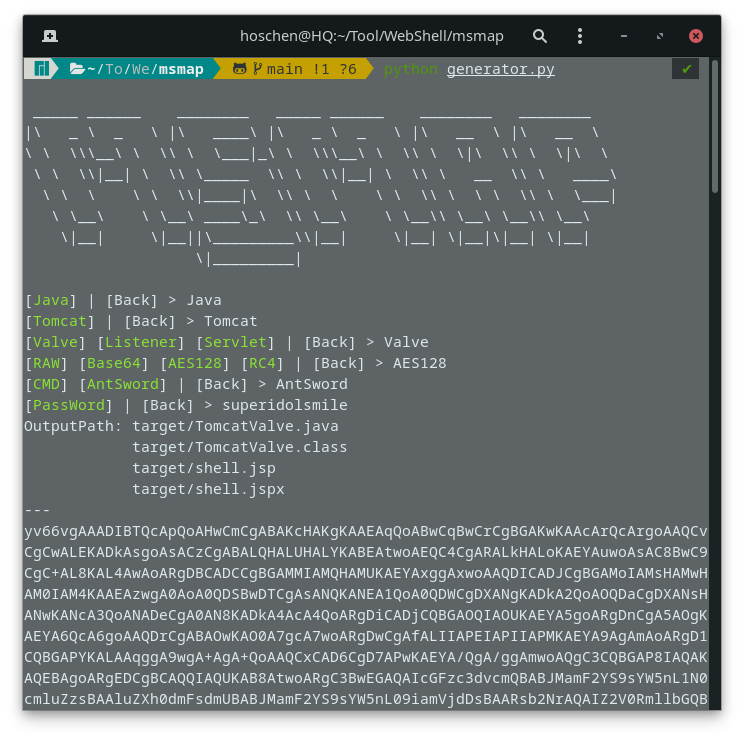
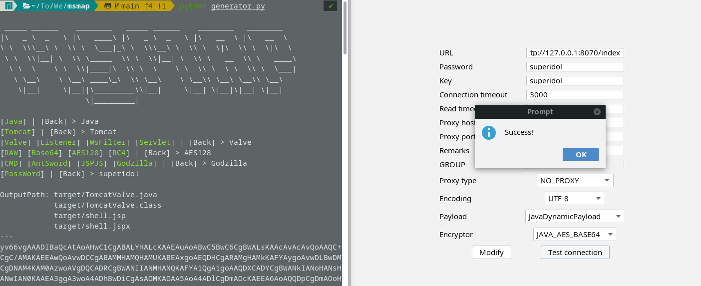
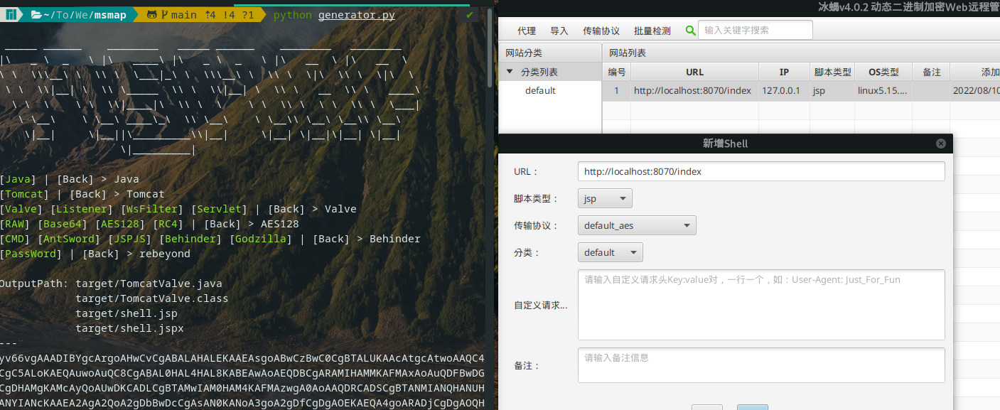

# MSMAP

Msmap is a Memory WebShell Generator. Compatible with various Containers, Components, Encoder, *WebShell / Proxy / Killer* and Management Clients. [简体中文](README_CN.md)

[The idea behind I](https://hosch3n.github.io/2022/08/08/Msmap%E5%86%85%E5%AD%98%E9%A9%AC%E7%94%9F%E6%88%90%E6%A1%86%E6%9E%B6%EF%BC%88%E4%B8%80%EF%BC%89/), [The idea behind II](https://hosch3n.github.io/2022/08/09/Msmap%E5%86%85%E5%AD%98%E9%A9%AC%E7%94%9F%E6%88%90%E6%A1%86%E6%9E%B6%EF%BC%88%E4%BA%8C%EF%BC%89/), [The idea behind III](https://hosch3n.github.io/2022/10/29/Msmap%E5%86%85%E5%AD%98%E9%A9%AC%E7%94%9F%E6%88%90%E6%A1%86%E6%9E%B6%EF%BC%88%E4%B8%89%EF%BC%89/)







<details>
<summary>Feature [WIP]</summary>

### Function

- [x] Dynamic Menu
- [x] Automatic Compilation
- [x] Generate Script
- [ ] Lite Mode
- [ ] Graphical Interface

### Container

- Java
  - [x] Tomcat7
  - [x] Tomcat8
  - [x] Tomcat9
  - [x] Tomcat10
  - [x] Resin3
  - [x] Resin4
  - [ ] WebSphere
  - [ ] GlassFish
  - [x] WebLogic
  - [ ] JBoss
  - [x] Spring*
  - [ ] Jetty
  - [ ] Netty
  - [x] JVM*
- .NET
  - [ ] IIS
- PHP
- Python

*: SpringHandler only support for JDK8+

*: JVM Default support for `Linux Tomcat 8/9`, more versions can be adapted according to the advanced guide.

### WebShell / Proxy / Killer

- WebShell
  - [x] CMD / SH
  - [x] AntSword
  - [x] JSPJS
  - [x] Behinder
  - [x] Godzilla

- No need for modularity

~~Proxy: Neo-reGeorg, wsproxy~~

~~Killer: java-memshell-scanner, ASP.NET-Memshell-Scanner~~

### Decoder / Decryptor / Hasher

- Decoder
  - [x] Base64
  - [ ] Hex
- Decryptor
  - [x] XOR
  - [x] RC4
  - [x] AES128
  - [x] AES256
  - [ ] RSA
- Hasher
  - [x] MD5
  - [x] SHA128
  - [x] SHA256

</details>

## Usage

``` bash
git clone git@github.com:hosch3n/msmap.git
cd msmap
python generator.py
```

> [Warning] MUST set a unique password, Options are case sensitive.

### Advanced

Edit `config/environment.py`

``` python
# Auto Compile
auto_build = True

# Base64 Encode Class File
b64_class = True

# Generate Script File
generate_script = True

# Compiler Absolute Path
java_compiler_path = r"~/jdk1.6.0_04/bin/javac"
dotnet_compiler_path = r"C:\Windows\Microsoft.NET\Framework\v2.0.50727\csc.exe"
```

Edit `gist/java/container/tomcat/servlet.py`

``` java
// Servlet Path Pattern
private static String pattern = "*.xml";
```

If an encryption encoder is used in WsFilter, the password needs to be the same as the path (eg `/passwd`)

`gist/java/container/jdk/javax.py` with `lib/servlet-api.jar` can be replaced depending on the target container.

`pip3 install pyperclip` to support automatic copying to clipboard.

## Example

<details>
<summary>CMD / SH</summary>

**Command** with **Base64** Encoder | Inject Tomcat Valve

`python generator.py Java Tomcat Valve Base64 CMD passwd`

</details>

<details>
<summary>AntSword</summary>

Type **JSP** with **default** Encoder | Inject Tomcat Valve

`python generator.py Java Tomcat Valve RAW AntSword passwd`

Type **JSP** with **[aes_128_ecb_pkcs7_padding_md5](extend/AntSword/encoder/aes_128_ecb_pkcs7_padding_md5.js)** Encoder | Inject Tomcat Listener

`python generator.py Java Tomcat Listener AES128 AntSword passwd`

Type **JSP** with **[rc_4_sha256](extend/AntSword/encoder/rc_4_sha256.js)** Encoder | Inject Tomcat Servlet

`python generator.py Java Tomcat Servlet RC4 AntSword passwd`

Type **JSP**  with **[xor_md5](extend/AntSword/encoder/xor_md5.js)** Encoder | AgentFiless Inject HttpServlet

`python generator.py Java JDK JavaX XOR AntSword passwd`

Type **JSPJS** with **[aes_128_ecb_pkcs7_padding_md5](extend/AntSword/encoder/aes_128_ecb_pkcs7_padding_md5.js)** Encoder | Inject Tomcat WsFilter

`python generator.py Java Tomcat WsFilter AES128 JSPJS passwd`

Type **JSPJS** with **[xor_md5](extend/AntSword/encoder/xor_md5.js)** Encoder | Inject Spring Handler

`python generator.py Java Spring Handler XOR JSPJS passwd`

</details>

<details>
<summary>Behinder</summary>

Type **default_aes** | Inject Tomcat Valve

`python generator.py Java Tomcat Valve AES128 Behinder rebeyond`

Type **default_xor_base64** | Inject Spring Interceptor

`python generator.py Java Spring Interceptor XOR Behinder rebeyond`

</details>

<details>
<summary>Godzilla</summary>

Type **JAVA_AES_BASE64** | Inject Tomcat Valve

`python generator.py Java Tomcat Valve AES128 Godzilla superidol`

Type **JAVA_AES_BASE64** | AgentFiless Inject HttpServlet

`python generator.py Java JDK JavaX AES128 Godzilla superidol`

Type **JAVA_AES_BASE64** | Inject Spring Handler

`python generator.py Java Spring Handler AES128 Godzilla superidol`

> [Known issue](https://github.com/BeichenDream/Godzilla/issues/76)

</details>

## Reference

[GodzillaMemoryShellProject](https://github.com/BeichenDream/GodzillaMemoryShellProject)

[AntSword-JSP-Template](https://github.com/AntSwordProject/AntSword-JSP-Template)

[As-Exploits memshell_manage](https://github.com/yzddmr6/As-Exploits/tree/master/core/memshell_manage)

[Behinder](https://github.com/rebeyond/Behinder) | [wsMemShell](https://github.com/veo/wsMemShell) | [ysomap](https://github.com/wh1t3p1g/ysomap)

<details>
<summary>Extended Reading</summary>

[利用“进程注入”实现无文件复活 WebShell](https://www.freebuf.com/articles/web/172753.html)

[基于内存 Webshell 的无文件攻击技术研究](https://landgrey.me/blog/12/)

[利用 intercetor 注入 spring 内存 webshell](https://landgrey.me/blog/19/)

[linux下java反序列化通杀回显方法的低配版实现](https://xz.aliyun.com/t/7307)

[Tomcat中一种半通用回显方法](https://xz.aliyun.com/t/7348)

[基于tomcat的内存 Webshell 无文件攻击技术](https://xz.aliyun.com/t/7388)

[基于全局储存的新思路 | Tomcat的一种通用回显方法研究](https://mp.weixin.qq.com/s?__biz=MzIwNDA2NDk5OQ==&amp;mid=2651374294&amp;idx=3&amp;sn=82d050ca7268bdb7bcf7ff7ff293d7b3)

[tomcat不出网回显连续剧第六集](https://xz.aliyun.com/t/7535)

[中间件内存马注入&冰蝎连接](https://paper.seebug.org/1441/#2mbeancontext)

[Java内存马：一种Tomcat全版本获取StandardContext的新方法](https://xz.aliyun.com/t/9914)

[Java内存攻击技术漫谈](https://xz.aliyun.com/t/10075)

[Linux下内存马进阶植入技术](https://xz.aliyun.com/t/10186)

[Spring cloud gateway通过SPEL注入内存马](https://gv7.me/articles/2022/the-spring-cloud-gateway-inject-memshell-through-spel-expressions/)

[CVE-2022-22947 注入哥斯拉内存马](https://blog.wanghw.cn/tech-share/cve-2022-22947-inject-godzilla-memshell.html)

[Linux下无文件Java agent探究](https://tttang.com/archive/1525/)

[论如何优雅的注入Java Agent内存马](https://xz.aliyun.com/t/11640)

</details>